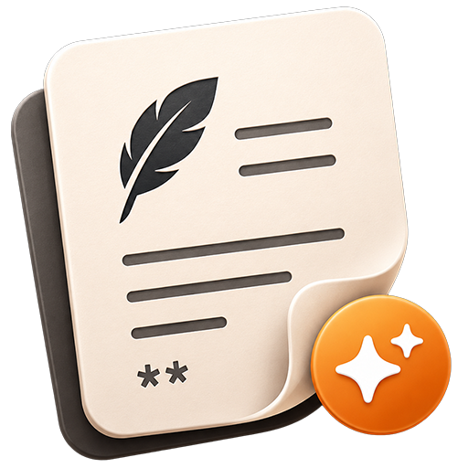
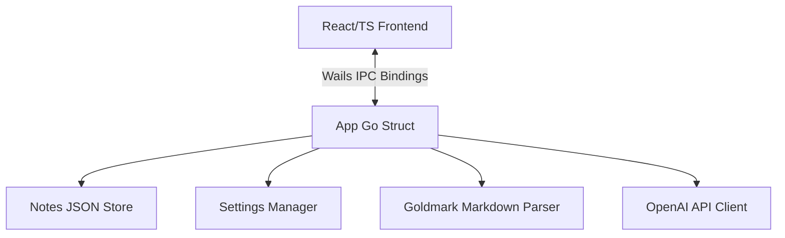

<p align="center">
  
</p>

<p align="center" style="font-size: 2em; font-weight: bold; margin: 15px 0 0 0;">✦ EasyNote</p>

<p align="center">
  A minimalist, distraction-free, markdown-first desktop note-taking application powered by Go, React, and Wails, featuring inline AI-assisted editing.
</p>


## Key Features

### ✍️ Refined Writing UX
* **Obsidian-like Editing:** Smart lists (auto-continuation on `Enter`, outdent on empty items), automatic indentation with `Tab`/`Shift+Tab`, and code fence protection.
* **Server-side Markdown Engine:** Ultra-fast rendering powered by Go (`goldmark`), with strict HTML sanitization and language-aware syntax highlighting (Chroma).
* **Zen Focus Mode:** An editable, distraction-free layout that removes layout chrome to maximize writing area.
* **Local-First & Auto-Save:** Instant local JSON persistence for notes and folder hierarchies, complete with custom undo/redo history.

### 🤖 Inline AI Tweak Flow
* **Quick Actions:** Select text to show an overlay bubble for instant editing: *Improve*, *Shorten*, *Fix Grammar*, or *Translate*.
* **Visual Diff Review:** View before/after changes side-by-side with strikethroughs and highlights. Choose to *Replace*, *Insert below*, or *Discard*.
* **Custom AI Persona:** Tailor the AI's behavior via a dedicated Settings tab: adjust temperature, default tone, output language, verbosity, and manage custom chip commands.
* **Interruptible Processing:** True backend-cancellation support for long-running AI generation.

### 🎨 Premium Aesthetics & Customization
* **Curated Themes:** Clean dark and light modes styled via hand-crafted CSS variables (no bloated utilities/frameworks).
* **Flexible Layouts:** Instantly toggle between **Classic (two-pane)**, **Three-pane (rail + list)**, and **Focus** modes.
* **Advanced Typography:** Atkinson Hyperlegible and Georgia/Monospace readability options with live-preview sliders for font size, width, and line spacing.
* **Bi-directional Layouts:** Full LTR and RTL mirroring system-wide (except the custom, frameless window title bar).

---

## Getting Started

### Prerequisites
* **Go** (1.18 or later)
* **Node.js** & **npm**
* **Wails CLI** (`go install github.com/wailsapp/wails/v2/cmd/wails@latest`)

### Development Run
To launch the app with live hot-reloading:
```bash
wails dev
```

### Production Build
To compile the standalone desktop executable (`EasyNote.exe`):
```bash
wails build
```

---

## Technical Architecture



* **Go Backend:** Serves as the source of truth for notes, application settings, Goldmark Markdown rendering, and direct OpenAI-compatible API communication.
* **React Frontend:** Powers the frameless UI layout, editor caret state management, custom keystroke interceptors, and local change-history tracking.

---

_Wait for more..._

Support me on PayPal

[](https://paypal.me/mohammadmoustafa1)
